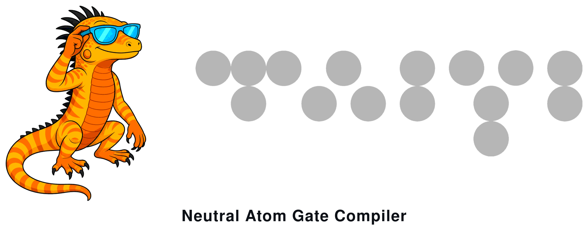

<p align="center">
  
</p>

# Gate Compiler

Compiles [OpenQASM 3](https://openqasm.com/) circuits into a hardware schedule for a neutral-atom quantum computer. Native gate transpilation, qubit routing, and atom-move / pulse scheduling.

## Requirements

- [zig](https://ziglang.org/): `>= 0.16.0`
- [just](https://github.com/casey/just) (optional): Every recipe maps to a plain `zig build` command
- [jq](https://jqlang.org/) (optional): Only for the `script/bench-*.sh` AB benchmarks

## Usage

- Quick start leveraging defaults.
```shell
# Build the binary (or: zig build && cp zig-out/bin/gatecomp .)
> just build

# Run the CLI with help options
> ./gatecomp -h

# Run a single circuit and visualize
> ./gatecomp ./ex/mvp/mvp.qasm --viz
```

For an in-depth understanding, see [CLI](./doc/cli.md).

## Configuration

`cfg/` holds the run configuration:

- `cfg/arch.toml`: The neutral-atom architecture (zones, SLM grids, AOD limits, constraints).
    - Edit it to experiment with different geometries.
- `cfg/assembly.json`: Storage occupancy handoff from the atom-rearrangement package.
    - Edit it to experiment with different initial placements.
- `cfg/settings.toml`: Encodes the input options (`[options]`: `arch`, `assembly`, `out`) for `--cfg`.

Everything under `cfg/` is user-editable; tests and golden snapshots pin their own copies under `testdata/`, so experiments never break the suite.

Inputs come from flags or from a config file, never both:

```shell
# Flag Mode:
# Specify inputs on the command line
> ./gatecomp circuit.qasm --arch cfg/arch.toml --out zig-out

# Config Mode:
# Reference a settings TOML instead
> ./gatecomp circuit.qasm --cfg cfg/settings.toml
```

Mixing `--cfg` with `--arch`, `--asm`, or `--out` is an error. The runtime toggles `--viz` and `-v/--verbose` are CLI-only and work in either mode. With neither flags nor `--cfg`, the built-in defaults apply.

## Benchmark

Passing several circuits runs them as a suite: the visualizer stays closed, each circuit writes [Schedule](./doc/schedule.md) and [Benchmark](./doc/benchmark.md) when the `out` directory is set, and a schedule-quality table prints:

```shell
> ./gatecomp ex/mqt/*.qasm --out zig-out

circuit           | qubits | frames |      cz |  colors | cz/pulse | shuttle_ms | load_ms | route_ms | compile_ms
-----------------------------------------------------------------------------------------------------------------
ae_20             |     20 |   2347 | 380/380 | 108/108 |     3.52 |       26.5 |    13.3 |     39.8 |       1.63
dj_20             |     20 |     67 |   19/19 |   19/19 |     1.00 |        1.4 |     0.2 |      1.5 |       0.16
ghz_20            |     20 |    426 |   19/19 |   19/19 |     1.00 |        5.5 |     2.3 |      7.8 |       0.24
graphstate_20     |     20 |     82 |   20/20 |     4/3 |     5.00 |        2.4 |     0.4 |      2.8 |       0.12
qft_20            |     20 |   1742 | 410/410 |   77/77 |     5.32 |       22.1 |     9.9 |     32.0 |       1.15
qftentangled_20   |     20 |   1842 | 429/429 |   79/79 |     5.43 |       22.9 |    10.3 |     33.2 |       1.05
qnn_20            |     20 |   2293 | 779/779 | 167/135 |     4.66 |       39.9 |    11.5 |     51.4 |       1.40
qpeexact_20       |     20 |   2436 | 407/407 | 111/111 |     3.67 |       28.8 |    13.8 |     42.6 |       1.07
qpeinexact_20     |     20 |   2436 | 407/407 | 111/111 |     3.67 |       28.8 |    13.8 |     42.6 |       0.86
realamprandom_20  |     20 |   2067 | 570/570 | 469/468 |     1.22 |       30.6 |     6.4 |     37.0 |       1.30
su2random_20      |     20 |   2068 | 570/570 | 469/468 |     1.22 |       30.6 |     6.4 |     37.0 |       1.12
twolocalrandom_20 |     20 |   2067 | 570/570 | 469/468 |     1.22 |       30.6 |     6.4 |     37.0 |       1.05
wstate_20         |     20 |    473 |   38/38 |   38/38 |     1.00 |        5.3 |     2.4 |      7.8 |       0.15
-----------------------------------------------------------------------------------------------------------------
```

## License

This project is released under the MIT License - see [LICENSE](LICENSE).
